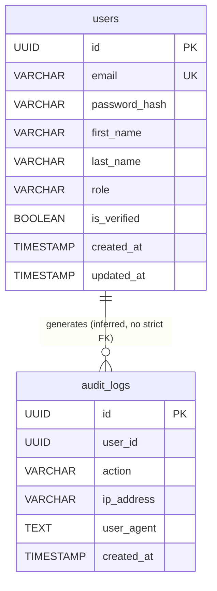

# Database Architecture

This document describes the database schema and configurations implemented in the repository.

## Infrastructure
- **Engine:** PostgreSQL 15 (Alpine)
- **Caching/Sessions:** Redis 7 (Alpine)
- **Migrations:** Handled via `.sql` migration files located in `services/auth-service/migrations`.
- **Database Name:** `globepulse`
- **Data Access Layer:** The `auth-service` uses standard `database/sql` combined with `github.com/jmoiron/sqlx` for queries. No heavy ORM is used.

## Schema Overview

The database schema is currently limited to the `auth-service` domain.

### Tables

#### `users`
Stores user identity and credentials.
- `id`: UUID (Primary Key)
- `email`: VARCHAR(255) (Unique, Not Null)
- `password_hash`: VARCHAR(255) (Not Null)
- `first_name`: VARCHAR(100) (Not Null)
- `last_name`: VARCHAR(100) (Not Null)
- `role`: VARCHAR(50) (Not Null, Default 'user')
- `is_verified`: BOOLEAN (Not Null, Default FALSE)
- `created_at`: TIMESTAMP WITH TIME ZONE (Default CURRENT_TIMESTAMP)
- `updated_at`: TIMESTAMP WITH TIME ZONE (Default CURRENT_TIMESTAMP)

#### `audit_logs`
Intended to store an immutable trail of user actions.
- `id`: UUID (Primary Key)
- `user_id`: UUID (Not Null) - *Note: Does not have a strict Foreign Key constraint enforcing referential integrity to `users` in the schema.*
- `action`: VARCHAR(255) (Not Null)
- `ip_address`: VARCHAR(45)
- `user_agent`: TEXT
- `created_at`: TIMESTAMP WITH TIME ZONE (Default CURRENT_TIMESTAMP)

## Entity Relationship Diagram

## Redis (Session Store)
- Redis is utilized as a key-value store.
- **Keys:** Session UUIDs.
- **Values:** JSON serialized session data (e.g., User ID, creation time).
