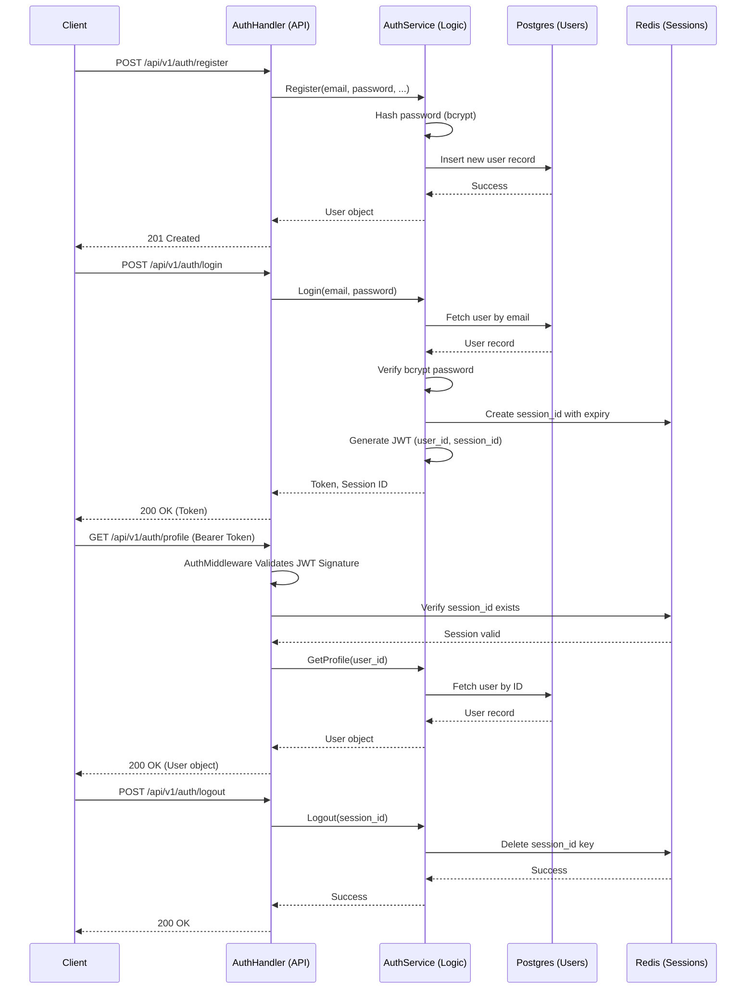

# Important Business Workflows

This document traces the significant implemented business workflows through the application code.

## 1. Authentication Lifecycle

## 2. Inferred / Planned Workflows

### AI Threat Analysis
Based on the configuration in the `ai-service` and `docker-compose.yml`, the intended workflow is:
1. A service (e.g., `news-service`) publishes an event to RabbitMQ.
2. The `ai-worker` (Celery) consumes the message from the `ai_analysis_queue`.
3. The Python code runs AI threat assessment (likely using the Gemini API based on `.env.example`).
4. Results are stored in the database or published back to RabbitMQ.
*Note: This flow is not actually implemented yet.*

### Frontend Data Hydration
The frontend (`App.tsx`) is intended to fetch live data from the backend services (presumably `analytics-service` or `news-service`), but it currently uses static arrays (`mockEvents`, `mockChartData`).
